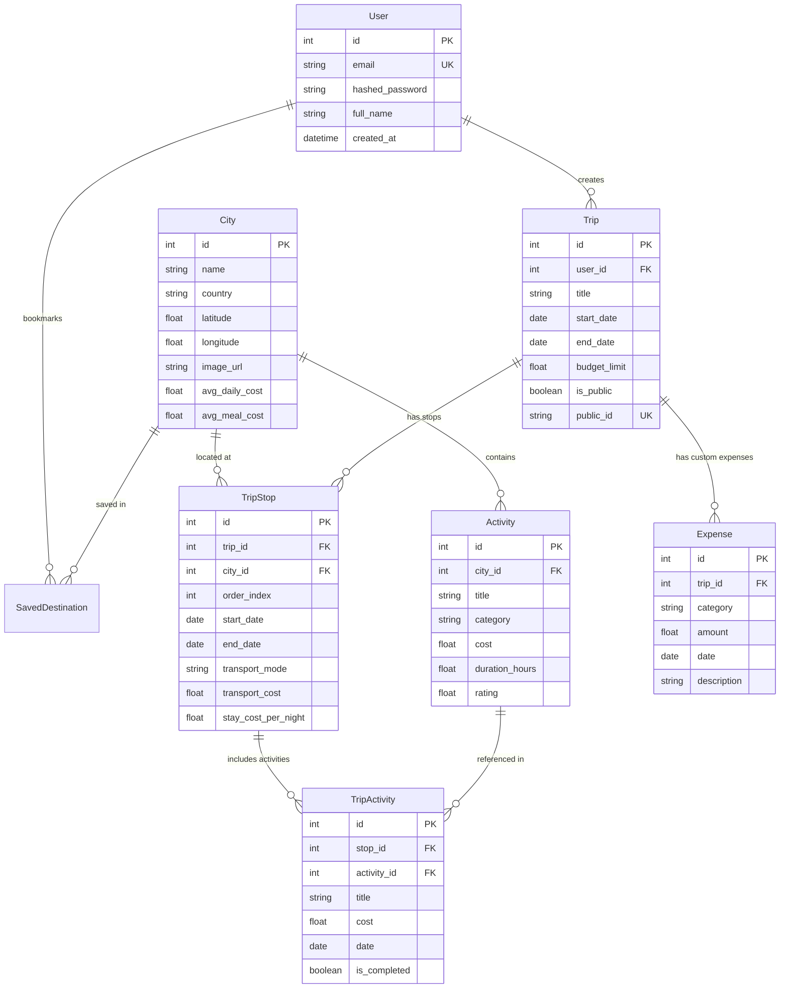

# GlobeTrotter - Backend API & Database Documentation

GlobeTrotter is a personalized multi-city travel planning application backend built with **FastAPI**, **SQLAlchemy**, **PostgreSQL / SQLite**, **Pydantic v2**, and **JWT Authentication**.

---

## Quick Start Guide for Frontend Integration

### 1. Environment Setup
Make sure Python 3.10+ is installed.

### 1. Environment Setup & Directory
Navigate to the `server/` directory:

```bash
cd server

# Install dependencies using python module (recommended on Windows PowerShell)
python -m pip install -r requirements.txt
```

### 2. Seed Database
Populate the database with 8 world cities, 15+ activities, demo users, trips, stops, and expenses:

```bash
python seed.py
```


* **Demo User Login**:
  - **Email**: `demo@globetrotter.com`
  - **Password**: `password123`
* **Demo Public Shared Trip Token**: `9b691066-f2a8-44ff-bccf-2fe99a18aec6`

### 3. Run Backend Server

```bash
python run.py
# OR
uvicorn app.main:app --reload --port 8000
```

- **Interactive API Documentation (Swagger UI)**: [http://127.0.0.1:8000/docs](http://127.0.0.1:8000/docs)
- **ReDoc API Reference**: [http://127.0.0.1:8000/redoc](http://127.0.0.1:8000/redoc)

---

## 🗄️ Relational Database Schema & Architecture

The database is fully normalized to avoid duplicate travel information and maintain relational integrity.



---

## 🔌 API Endpoints Summary

All authenticated endpoints require an `Authorization: Bearer <access_token>` HTTP header.

### 🔐 Authentication (`/auth`)
| Method | Endpoint | Description | Auth Required |
|---|---|---|---|
| `POST` | `/auth/register` | Register a new user account | ❌ No |
| `POST` | `/auth/login` | Authenticate user & receive JWT token | ❌ No |
| `GET` | `/auth/me` | Fetch current logged-in user profile | ✅ Yes |

---

### 🗺️ Cities & Master Activities (`/cities`, `/activities`)
| Method | Endpoint | Description | Auth Required |
|---|---|---|---|
| `GET` | `/cities` | List & search cities (`?q=paris`) | ❌ No |
| `GET` | `/cities/{city_id}` | Get city details with embedded activities | ❌ No |
| `GET` | `/activities` | List activities (`?city_id=1&category=Sightseeing`) | ❌ No |
| `GET` | `/activities/{activity_id}` | Get activity details | ❌ No |

---

### ✈️ Trips Management (`/trips`)
| Method | Endpoint | Description | Auth Required |
|---|---|---|---|
| `GET` | `/trips` | List all trips created by current user | ✅ Yes |
| `POST` | `/trips` | Create a new multi-city trip | ✅ Yes |
| `GET` | `/trips/{trip_id}` | Get full trip detail (stops, activities, expenses) | ✅ Yes (unless public) |
| `PUT` | `/trips/{trip_id}` | Update trip title, dates, budget limit | ✅ Yes |
| `DELETE` | `/trips/{trip_id}` | Delete trip (cascades to stops & activities) | ✅ Yes |

---

### 📍 Stops Management (`/trips/{trip_id}/stops`, `/stops`)
| Method | Endpoint | Description | Auth Required |
|---|---|---|---|
| `POST` | `/trips/{trip_id}/stops` | Add a city stop to a trip | ✅ Yes |
| `PUT` | `/stops/{stop_id}` | Update stop dates, transport, or stay costs | ✅ Yes |
| `DELETE` | `/stops/{stop_id}` | Delete a stop | ✅ Yes |
| `PATCH` | `/trips/{trip_id}/stops/reorder` | Reorder stops list | ✅ Yes |

---

### 🎭 Trip Activities (`/stops/{stop_id}/activities`, `/trip-activities`)
| Method | Endpoint | Description | Auth Required |
|---|---|---|---|
| `POST` | `/stops/{stop_id}/activities` | Add activity to a specific stop | ✅ Yes |
| `PATCH` | `/trip-activities/{id}` | Toggle completion (`is_completed`), update notes | ✅ Yes |
| `DELETE` | `/trip-activities/{id}` | Remove activity from stop | ✅ Yes |

---

### 💰 Budget & Server-Side Cost Calculations (`/trips/{trip_id}/budget`)
| Method | Endpoint | Description | Auth Required |
|---|---|---|---|
| `GET` | `/trips/{trip_id}/budget` | Get detailed server-side cost & budget analysis | ✅ Yes (unless public) |

**Returned Budget Payload Structure:**
```json
{
  "trip_id": 1,
  "trip_title": "European Grand Discovery Tour",
  "budget_limit": 2500.0,
  "total_days": 10,
  "transport": 450.0,
  "stay": 960.0,
  "activities": 123.0,
  "meals": 750.0,
  "other_expenses": 50.0,
  "total_estimated_cost": 2333.0,
  "average_daily_cost": 233.3,
  "over_budget": false,
  "budget_difference": 167.0,
  "categories": [
    { "category": "Transport", "amount": 450.0, "percentage": 19.3 },
    { "category": "Stay", "amount": 960.0, "percentage": 41.1 },
    { "category": "Activities", "amount": 123.0, "percentage": 5.3 },
    { "category": "Meals", "amount": 750.0, "percentage": 32.1 },
    { "category": "Other", "amount": 50.0, "percentage": 2.1 }
  ]
}
```

---

### 📅 Timeline (`/trips/{trip_id}/timeline`)
| Method | Endpoint | Description | Auth Required |
|---|---|---|---|
| `GET` | `/trips/{trip_id}/timeline` | Get day-by-day chronological itinerary | ✅ Yes (unless public) |

---

### 🔗 Public Sharing (`/trips/{trip_id}/share`, `/shared/{public_id}`)
| Method | Endpoint | Description | Auth Required |
|---|---|---|---|
| `POST` | `/trips/{trip_id}/share` | Enable public link & get `public_id` | ✅ Yes |
| `GET` | `/shared/{public_id}` | Read shared trip details anonymously | ❌ No |

---

## 💻 Frontend Code Snippets (React / Axios / Fetch)

### Login & Storing Token
```javascript
const login = async (email, password) => {
  const response = await fetch('http://127.0.0.1:8000/auth/login', {
    method: 'POST',
    headers: { 'Content-Type': 'application/json' },
    body: JSON.stringify({ email, password }),
  });
  const data = await response.json();
  if (response.ok) {
    localStorage.setItem('token', data.access_token);
    return data.user;
  } else {
    throw new Error(data.detail);
  }
};
```

### Fetching User Trips with Bearer Auth Header
```javascript
const fetchTrips = async () => {
  const token = localStorage.getItem('token');
  const response = await fetch('http://127.0.0.1:8000/trips', {
    headers: {
      'Authorization': `Bearer ${token}`
    }
  });
  return await response.json();
};
```

---

## ⚠️ Validation & Error Response Rules

The backend strictly enforces the following constraints and returns HTTP standard error codes:

1. **Date Bounds**:
   - `start_date` must be `<= end_date` for trips and stops.
   - Stop dates MUST fall within trip start and end dates.
   - Activity dates MUST fall within stop start and end dates.
   - *Error Code*: `400 Bad Request` or `422 Unprocessable Entity`.
2. **Ownership & Access Control**:
   - Modifying or deleting a trip, stop, or activity that belongs to another user returns `403 Forbidden`.
   - Accessing a private trip without being the owner returns `403 Forbidden`.
3. **Entity Existence**:
   - Requesting non-existent trip, stop, activity, or city returns `404 Not Found`.

---

## 🧪 Running Automated Tests

Run the full pytest suite covering authentication, trip CRUD, budget formulas, date boundaries, and sharing:

```bash
python -m pytest
```
